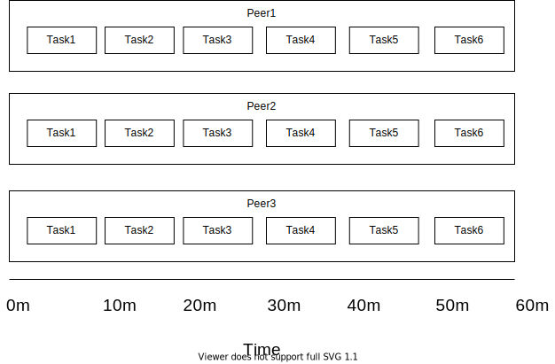

# Task Director

## Overview

Task Director is essentially a P2P load balancer. It receives tasks from peers and then distributes tasks over all available peers. It uses a centralised system, meaning a server instance needs to be up and running and peers need to have knowledge of the server.

### Background

## Overview

### 1 Existing setup

The Task Director is perfect for peers which each have identical or similar tasks that need to be completed. An example of the perfect scenario is shown below. In the diagram there are three peers who need to perform the same six tasks. In this scenario, a task is a unit of work whose result/output can be shared amongst all peers.


How do we get all peers to have the result of all of their tasks? There are two obvious ways: schedule the each peer to run their tasks in parallel, or schedule each peer to run their tasks linearly.

#### 1 Linear Execution


#### 1 Parallel Execution



### 2 Proposed Setup


The task director aims to distribute and prioritise tasks between available peers.

### Peers

Once a peer is ready to build, it will open up a websocket with the central authority and send the following information:

- Peer name/ID
- Base ref (e.g. master)
- Change ref / PR number
- Repository
- Pipeline name
- Pipeline type (independent or dependent)
- Remote Cache ID (e.g. muc9 or muc10)
- Schema ID
- Current step

During the main run/build step, a python process will request will ask the central authority what to build, and will build the requested targets.

### Schema

A schema is a universe and set of steps. The idea behind the steps is to find targets which take a long time to compile, and having them cached is a faster way to ultimately get the schemas universe successful built.

```json
{
	"universe": "//my_universe/...",
	"steps": {
		"1": "//my_universe/common/...",
		"2": "//my_universe/planning/...",
		"3": "//my_universe/perception/...",
		"4": "//my_universe/test/..."
	}
}
```

### The Central Authority

The Central Authority will receive task requests and prioritise them accordingly.
